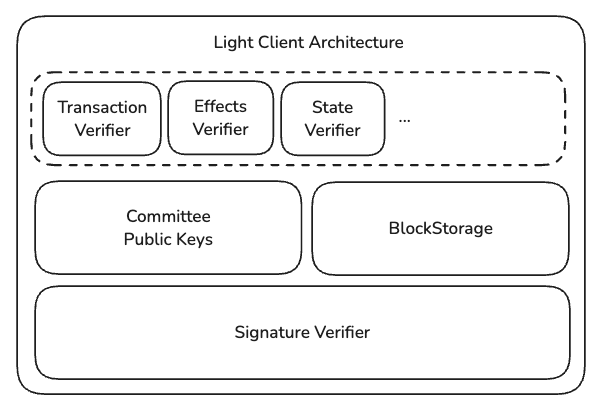
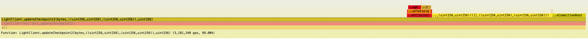
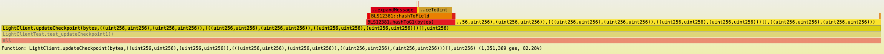

# Zuika: A Sui ZK Light Client

Patrick Mao <patrickmao@live.com>

## Abstract

Zuika is a proof-of-concept ZK light client that is able to verify Sui checkpoints, transactions, and effects on
Ethereum. At the highest level of abstraction, it can be considered an oracle that can be queried by smart contracts on
Ethereum for events happen on Sui. Applications can use Zuika to implement a unidirectional information bridge from Sui
to Ethereum. Zuika achieves this information bridging without trusting any third parties, and its security depends
solely on the underlying zero-knowledge proof's security promises and implementation correctness.

## 1. Introduction

In the past decade, distributed ledger systems or blockchain systems have established themselves into a substantial
industry.
Bitcoin and Ethereum led the way of generalizing blockchains into not only distributed ledgers but a secure and shared
world computer. There are also newer systems like the Sui blockchain that are built on top of the
pioneers. Old or new, many blockchain systems have several common limitations. First, on-chain resources are expensive.
Computation and data storage remain a significant cost to the users of the blockchain. Second, the type of data an
on-chain program (smart contract) can access is limited. For example, a contract cannot access data from other chains (
an interoperability problem).
Moreover, most blockchains cannot even access many types of data on the same chain, such as data that exist in the
consensus layer, or historical data (a data availability problem).
One could build an on-chain system that "checkpoints" historical data as the chain state progresses.
But doing so, the developers expose themselves to the first problem where transaction and on-chain storage cost deter
them away from scaling their project.

To solve the data access problem, many projects settle for less-than-ideal models. For blockchain interoperability, the
most common model is the notary model [1] [2]; and for same-chain data access, earlier projects could only rely on
either an expensive on-chain checkpointing mechanism or a centralized oracle. These models pose
centralization concerns, and the many bridge and centralized exchange hacks [3] happened in the past few years
have proven the point.

The alternative to trusting a third party for on-chain data has always existed. Many blockchains support light
clients -- blockchain client so light weight that it can verify blockchain states without needing to download the entire
chain [4]. But moving a light client on-chain has always been impractical. For example, to grant an on-chain
program the ability to verify some historical transaction effects, the program must have the ability to verify the
blocks in which those effects exist.
In Proof-of-Stake blockchains such as Sui, this entails uploading Sui's
authority committee's public keys, which can be expensive. The verification of various types
signatures (e.g. ECDSA, BLS) also aren't standardized across different chains, limiting on-chain verification's
applicability. These limitations made on-chain light clients largely impractical before the emergence of Zero-knowledge
proof technologies.

The recent advancement in Zero-knowledge Proof (ZKP) technologies completely changed the landscape. Applications
such as on-chain light clients that previously deemed "too expensive" are now within reach as data verifications can be
delegated to the proving work off-chain in arithmetic circuits. Many developers rush to implement ZK based
blockchain applications. Among them, using ZK technologies to achieve blockchain bridges is popular.

**From Academia: zkBridge.** zkBridge [5] lays a rigorous foundation in the implementation of the ZKP-based
blockchain bridge from Tendermint-based blockchains to Ethereum. It focuses on the overall architecture of their system
and rigorous proving of the completeness and soundness of their ZK circuits. The most impactful method developed in the
paper regarding using ZK to verify block header signatures is the use of aggregated proofs which enables distributed
proving on data-parallel circuits. Because the heaviest workload of proving a block’s validity in a ZK light client is
the verification of signatures which means the signature check sub-circuits are just copies of each other, the authors
developed an idea to parallelize N instances of the signature proofs in a distributed manner and then aggregate the
verification of these proofs in a master circuit. This gives us a succinct final proof that is independent of N. Since
the proof generated is not directly verifiable on Ethereum, zkBridge wraps the proof in another Groth16 proof over the
BN254 curve for which there exists efficient precompiles for pairing check on Ethereum.

**From the Industry: Brevis zkCoprocessor.** There isn't much academic literature in the area of applied ZK bridges,
but more implementations of ZK bridges exist in the industry. Among them, Brevis’ zkCoprocessor [6] seems to be the only
project that is still being maintained. Brevis’ architecture allows users (developers) to compile and run their circuits
through their SDK. The circuit is then embedded in the context of a larger backend proof system which provides the
user circuit verified Ethereum block headers, transactions, and receipts. The contract repo suggests that the final
verification is a Groth16 proof which means that the backend proof system is either different from the user ones or is
wrapped in a final Groth16 proof for more efficient on-chain verification. Every time the sync committee is updated,
there is a proof that commits all the committee public keys into a single root and stored on-chain in the light client
contract. The stored root is a public input in the block signature verification proof so that when the proof is verified
by the light client contract, it can prove the block is signed by a committee that is known by the light client
contract. This differs from how a normal (off-chain) Ethereum light client as the normal ones saves the entirety of the
public keys on disk.

**From the Industry: Axiom Coprocessor.** The functionalities of Axiom Coprocessor [7] are almost identical to Brevis’
zkCoprocessor. The major difference is that Axiom uses PLONK for all their proof systems as opposed to Brevis’ GROTH16.
Another difference is that for the storage of the proven blocks, Axiom uses Padded Merkle Mountain Range (PMMR) as
opposed to the Sparse Merkle Tree (SMT) that Brevis uses. This difference likely comes from favoring different
trade-offs. PMMR is infinitely updatable but has the cost of maintaining multiple roots while SMT is much simpler and
only has one single root to manage which saves storage cost on-chain but has a finite capacity.

To our knowledge, no existing work has investigated into the possibility of building an efficient ZK light client for
Sui.
This paper focuses on uncovering and addressing the challenges imposed by such a task.
We show that building an
economically viable Sui ZK light client is possible, and we evaluate the cost of verification on Ethereum, which is
typically the most expensive blockchain to run smart contracts on.

Our contributions:

- A proof of concept of a Sui checkpoint verifier (verifier contract and BLS G1 aggregate signature verifier circuit)
- An analysis on the cost of BLS12-381 hash-to-curve using the new Ethereum BLS precompiles
- We opensource an in-circuit dynamic Blake2b library implemented in Gnark [8]
- We also opensource a BLS12-381 (G1 signature) contract library that we used to test the cost of BLS hash-to-curve in
  contract

## 2. Background

### 2.1 The Sui Blockchain

### 2.1.1 Key Concepts

Sui uses a rather different set of terminologies to describe commonly appearing terms in all blockchains. For this
reason, this section is used to clarify these terms.
We will use those equivalent terms listed below interchangeably in this paper.

- **Authority/Validator** An authority is a member of the Sui network. An authority is responsible for participating
  in the consensus.
  To become an authority on Sui, one needs to run a Sui blockchain node and lock a certain amount of SUI (the
  cryptocurrency) on Sui.
- **Checkpoint/Block** A "checkpoint" means "block" in the context of most blockchains.
  A checkpoint may contain transactions submitted by users and is signed by the authorities in the network.
  In the context of this paper, "checkpoint" mostly means "checkpoint summary"
  which is equivalent to "block header."

### Authority Committee

Time on Sui is divided into epochs of approximately 24 hours.
The authority committee stays unchanged for the entire epoch.
This means new members request to join the committee in epoch $n$ is only added to the committee in epoch $n+1$.
Similarly, leaving the committee is also only effective in the next epoch.
As of the time of writing, Sui has a total of 113 authorities.
There can be many checkpoints proposed and committed in one epoch.
A special checkpoint marks the end of an epoch.
This checkpoint contains the public keys of the committee members for the next epoch.

### 2.2 Blockchains and Light Clients

Blockchains are distributed systems that maintain a shared ledger of transactions in a decentralized temper-proof
manner. A typical decentralized blockchain consists of a network of member nodes ranging from tens to hundreds of
thousands. The participants of the network reach consensus on the order of blocks containing user transactions and
execute them to alter blockchain state.

#### 2.2.1 Proof-of-Stake Blockchains

Today's top blockchain systems mostly employ the Proof-of-Stake (PoS) consensus model. The users sign transactions via
cryptographic signature schemes and submit transactions to the blockchain. The blockchain members, often called
*validators* or *authorities* (used interchangeably), check the validity of the transactions by verifying its
signature. A batch of transactions is typically packaged into a *block* and validators in the blockchain network check
the validity of the blocks and provide attestations by **signing the blocks**. This action is often referred to as "
voting". In typical PoS, how much *voting power* that a validator's signature represents is directly determined by how
much *stake* (in terms of cryptocurrencies) they have locked into the system.
Different blockchains have different requirements in how much voting power is needed on a single block for it to be
considered *finalized*. For example, Ethereum requires more than $\frac{2}{3}$ voting power of the entire
network [9]; while in Algorand [10], since the voting committee is dynamic and can be different for each block, the
absolute amount of voting power required is also dynamic. Nonetheless, Algorand still requires all blocks to gather more
than $\frac{2}{3}$ voting power of the specific committee for it to be considered finalized. The network reaches
consensus on the order of the blocks, execute the transactions in the blocks to change their state. Since blockchains
are modeled as deterministic state machines, a total order of transactions implies the eventual consistency of
individual nodes' state.

#### 2.2.2 Blockchain Light Clients

A blockchain light client is a client that verifies blockchain data (such as block headers and transactions)
without downloading or storing the entire blockchain. Instead of maintaining the full state, it relies on minimal
data to validate correctness and security.

Figure 1 shows a simplified view of the components in a typical PoS light client. The _signature verifier_ verifies
block headers are signed correctly by the current committee by verifying the signatures against the committee
members' public keys.
The light client then can either save the verified block headers directly in its storage or only save the block
hashes to save space.
Block headers typically include digests of the transactions, effects, or state roots in them.
The light client can query proofs for the data it wants to verify against its known blocks.
For example, on Sui, block headers have a field `content_digest` which is a hash that captures all transactions in the
checkpoint.
To verify a transaction in that checkpoint, the light client needs to have all other transcations and effects as a
proof.
To check the proof, the light client serializes all transactions (including the transaction of interest) and effects
and verify that the digest matches the `content_digest` of a known checkpoint.

Figure 1: A simplified view of a typical light client's architecture

#### 2.2.3 Blockchain ZK Light Clients

A ZK light client is also a blockchain light client but with the goal making it even "lighter" by offloading some
verification steps to a ZK prover.
And the light client only needs to verify a ZK proof to verify (potentially a batch of) blocks.
Because generating ZK proofs for the verification of blocks is a computation intensive task, a ZK light
client normally only makes sense if the verifier of the proof is even less efficient.
This explains why the verifier in a ZK light client is typically a smart contract.

## 3. Implementation & Evaluation

We use Gnark [8] to implement all our circuits for the reason that it is performant enough for our
proof-of-concept, its support for both Groth16 and PLONK backends, and its support for emulated BLS12-381 operations
over BN254 scalar field.

### 3.1 Preliminaries

#### Binary Canonical Serialization

Binary Canonical Serialization (BCS) is the serialization format that Sui uses for most of its on-chain data. More
specifically, Sui uses BCS to serialize objects such as checkpoints, transactions, effects, Sui objects, and many
more.
BCS is a schemaless serialization format in that the data itself does not contain information on the structure of
the data.
The serializer and deserializer both need to have the knowledge of the schema to serialize/deserialize.

#### Authority Signatures and BLS12-381

BLS12-381 is part of a family of curves described by Barreto, Lynn, and Scott [11].
It is used primarily as a signature scheme in Sui consensus for its signature aggregation capability.
To reach consensus on a checkpoint, Sui authorities perform the Mysticeti consensus [citation] that is quite
different from classical BFT consensus, but the argument for finality is similar.
They both rely on quorum intersections, which means to verify that a checkpoint is committed, we need to check that
the checkpoint's aggregated signature contains $>\frac{2}{3}$ authorities' signatures.

### 3.1 Scope

We focus on the implementation of the Sui checkpoint verifier component in a light client.
In principle, checkpoint verification is the very core of the light client.
Because Sui includes the next committee public keys in the end-of-epoch checkpoints, if we can verify checkpoints,
then verifying transactions and effects can be done easily against the verified checkpoints.
This focus omits the complexity in that how we could batch update checkpoints to a light client contract is not
trivial.
But we have already seen efficient designs demonstrated by the aforementioned projects Axiom and Brevis.
As such, we still describe a design for the batch updating process, but we do not implement or evaluate it.

### 3.2 Checkpoint Verifier Overview

The checkpoint verifier comprises two components:

- **`CommitteeSigVerifier` Circuit** Aggregates the public keys of the current committee according to the signer bitmap,
  counts the effective stake units, and does BLS12-381 pairing check to checkpoint signature.
- **Light Client Contract** Verifies the ZKP generated via the `CommitteeSigVerifier` circuit against the known
  committee digest and saves the verified checkpoint digest in the contract's storage.

### 3.2 Updating Checkpoints

Regular checkpoints are all checkpoints that are not end-of-epoch checkpoints. They do not contain the committee's
public keys of the next epoch, making them much smaller.
Our evaluation will be performed on the regular checkpoints as they are the "common case."
But the method is the same for updating the end-of-epoch checkpoints.

#### 3.2.1 Baseline

We use a pure contract implementation of the Sui light client as the baseline.
A pure contract implementation was previously considered not possible because efficient precompiles for BLS12-381
operations such as point addition and pairing check did not exist on Ethereum.
However, since Ethereum will have BLS precompiles starting from the planned "Pectra" hard fork [citation], we
calculate an estimation on the cost of implementing a Sui light client purely in Solidity.

**Storing All Public Keys On-chain.**
The simplest design is to store all committee public keys on-chain.
Even if we omit the amortizable storage cost of public keys, the sheer number of SLOAD [citation] operations for loading
113 public keys from storage to memory costs a significant amount of gas.
Moreover, BLS12-381 pairing check cost is also not cheap even with the precompiles.
Each pairing check costs $32600 \cdot k + 37700$ gas where $k$ is the number of pairs.
BLS12-381 signature verification involves two pairs, the cost of pairing is 102K gas.
Figure 2 shows that the total cost of verifying a single checkpoint on-chain with public keys stored on-chain.
The total cost sums to over 3.1 million gas.

Figure 2: Gas cost flamegraph of a pure on-chain checkpoint verifier with public keys stored on-chain. The long white
space over LightClient.updateCheckpoint2() indicates the cost related to non-application functions. We suspect it is
majorly the cost of the SLOAD opcodes that loads the public keys from storage.

**Storing a Commitment of Public Keys On-chain.**
A common strategy to minimize storage cost is to store only a hash commitment of the large data on-chain and provide
the preimage when calling contract functions.
But calldata still costs gas, albeit much cheaper than storage.
We implement this method and test the gas usage with Foundry.
Figure 3 shows the total cost is still relatively high, summing up to over 1.6 million gas.

Figure 3: Gas cost flamegraph of a pure on-chain checkpoint verifier with only public key commitment stored on-chain.
We suspect the long white space over the LightClient.updateCheckpoint1() call indicates the calldata cost.

**Other Downsides of Contract-based Light Clients**
A light client likely needs to verify batches of checkpoints at once.
Usages such as marketing campaigns can require the light client to prove that a user has made a certain number of
transactions during a span of checkpoints.
We can avoid signature verification and leverage the fact that all checkpoints contain their previous checkpoint's
digest and only check the chain of hashes.
But this would entail inputting a large amount of checkpoint in raw bytes format to the contract, incurring even
more calldata cost.

For the inefficiency of the baseline light client building approach, we introduce a way to verify Sui checkpoints in
ZK circuits and show that it minimizes the cost in terms of gas spent in contract.

#### 3.3.1 Initial Approach: "Small Contract, Big Circuit"

In this section, we show our initial attempt in implementing a "Small Contract, Big Circuit" design which offloads as
much workload to the circuit as possible to reduce on-chain gas cost incurred by updating checkpoints.
We also show that such approach is hard to implement due to the way that the checkpoints are signed.

##### 3.3.1.1 Circuit Design

The circuit has the following input:

Public Input

- Checkpoint sequence number $h$
- Content digest $C_h$: a digest that captures all transaction and effects in that checkpoint
- Authority committee digest $D_h$: a digest that captures all public keys of the current committee
- Next committee digest $D_{h+1}$: a digest that captures all public keys of the next committee (optional, only exists
  if the
  check is an end-of-epoch checkpoint)

Private Input

- Checkpoint data: the BCS serialized checkpoint summary in bytes
- Public keys $PK$: a vector containing the public keys of the current committee.
  Each $PK_i$ is in the form of a gnark G2 affine point.
- Stake Units: a vector containing the stake units of the current committee
- Signature Sig: the aggregated BLS signature over the checkpoint provided by the current committee
- Signer map $V$: a vector in $\{0,1\}^*$ where $V_i = 1$ indicates the aggregate signature contains the
  signature, and $V_i = 0$ indicates the converse.
  from the authority of index $i$.

##### 3.3.1.1 Challenge: Dynamic-Length Message

This design approach imposes a challenge on circuit implementation.
Instead of signing over a checkpoint's digest, Sui authorities sign over the checkpoint directly.
More precisely, they sign over the checkpoint intent.
This method of signing makes the input to the signature function **dynamic**.
Arithmetic circuits usually need extra handling for dealing with dynamic-length input.
Normally, special handling is done by allocating a maximum of input variables, partially filling these variables
with the actual data, and filling in the rest with default values (usually zeros).
However, for verifying a BLS12-381 signature over a dynamic-length message, this technique is ineffective because of
how the first step of BLS signature verification works.
To convert a message to a point on curve (i.e., BLS hash-to-curve operation), BLS signature (the G1 signature variant)
first uses the `ExpandMessageXmd` function to 128 bytes.
Because of the way that the message is padded in Algorithm 1, it is hard to input the dynamic checkpoint bytes with
zeros padded at the end.

Algorithm 1: IETF RC9380 ExpandMessageXmd [citation]. The highlighted section indicates how the to-be-signed message is
padded
on both ends before the rest of the hashing steps.

##### 3.3.1.2 Naive Solution: "Big Contract, Small Circuit"

Since it is hard to implement hash-to-curve in circuit that operates on a dynamic-length message, a naive solution would
be directly delegating the burden of hash-to-curve to the contract.
The circuit now takes a new set of input:

Public Input

- Checkpoint on curve: the checkpoint data as a BLS12-381 G1 curve point.
- Authority committee digest $D_h$: a digest that captures all public keys of the current committee

Private Input

- Public keys $PK$: a vector containing the public keys of the current committee.
  Each $PK_i$ is in the form of a gnark G2 affine point.
- Stake Units: a vector containing the stake units of the current committee
- Signature $Sig$: the aggregated BLS signature over the checkpoint provided by the current committee
- Signer map $V$: a vector in $\{0,1\}^*$ where $V_i = 1$ indicates the aggregate signature contains the
  signature, and $V_i = 0$ indicates the converse.
  from the authority of index $i$.

Notably, the checkpoint data is not input as a public input to the circuit as a G1 curve point so that we can input
the raw checkpoint bytes to the contract and let it compute hash-to-curve.
The fact this delegation to contract is possible at all is due to the recent addition of BLS12-381 precompiles on
Ethereum [citation].

#### 3.3.1.3 Cost Analysis

We implement an experimental BLS hash-to-curve in Solidity to test the cost in terms of gas.
Table 1 shows that even with the precompiles, hash-to-curve remains a costly operation on Ethereum, amounting to
294K gas.

Table 1: Costs of verifying a single checkpoint (the naive solution)

#### 3.3.2 A Better Approach: "Medium Contract, Medium Circuit"

A key insight is that not the entire hash-to-curve operation is problematic.
The issue of dealing with dynamic-length messages only exists within the `ExpandMessageXmd` function.
After the function returns, the output is some fix-sized bytes.
The idea is to move only the `ExpandMessageXmd` function to contract, and make the output of the function a public
input to the circuit.
The private input of the circuit stays unchanged and the public input is now:

Public Input

- Expanded checkpoint: the output of `ExpandMessageXmd(checkpoint_bytes)`, 128 bytes, packed as six 248-bit variables.
- Authority committee digest $D_h$: a digest that captures all public keys of the current committee

Circuit Definition

The circuit:

- Computes the effective staking units $S_{e}$ from $V$: $S := \sum_{i=0}^{i=N}V_i$ where N is the current
  committee's size.
- Asserts $S_e > \frac{2}{3} S_{total}$ where $S_{total}$ is the total stake units of the current committee
- Computes the MiMC digest of the committee public keys $D_h' := MiMC(PK_0 || PK_1 || ... || PK_N)$
- Asserts $D_h' = D_h$
- Computes the aggregate of the public keys $PK_{agg}$ according to the signer map
- Performs BLS12-381 map-to-curve (G1) on the expanded checkpoint (128 bytes), acquire two G1 points $E_1, E_2$,
  then compute the message on curve $E := E_1 + E_2$
- Pairing check $e(Sig, g2) \stackrel{?}{=} e(E,PK_{agg})$ where $g2$ is the generator of the G2 group

#### 3.3.2.1 Cost Analysis

Table 1 shows the cost analysis of this approach.
We observe that the naive method incurs 63% more gas than the better approach in the overall gas cost compared to the
naive solution. The cost of verifying ZKP stays the same because the number of public inputs happens to be unchanged.
Excluding the ZKP verification, the cost overhead reduced by more than 3x, bringing the total down to 440K gas per
checkpoint verification (roughly $3 as of the time of writing).
The number of circuit constraints only sees a 3% increase over the naive method.
This is due to the fact that the circuit size is dominated by the much more demanding emulated BLS pairing check.

Table 2: Costs of verifying a single checkpoint (the better solution)

The cost saving is even more pronounced when compared to the baseline method (1.6 million gas).
In terms of overall gas cost, the baseline method is 2.63x more expensive for single checkpoint verification.

## 4. Future Works

**Batch Checkpoint Update.**
Our system focuses on making the verification of a single checkpoint efficient as it is the core to a ZK light client.
With this foundation in place, future work can focus on higher level constructs such as batch checkpoint update.
A potentially efficient design is to leverage the nature of a blockchain where blocks are connected by a chain of
hashes.
The ZK circuit can take in a set range $R$ of checkpoints, hash each of them and check if the entire list is
connected.
Only the last checkpoint needs to have its signatures verified against the current committee public keys
The circuit then expose only the last checkpoint's digest $D_{last}$ as public input.
The contract verifies the batch update proof, and acquires the knowledge that all blocks in range $R$ until
checkpoint $D_{last}$ are all verified.
We also implemented an in-circuit Blake2b hash function that supports dynamic input size, and it can be used for this
purpose.

**Transaction/Effect Verification**
Once ranges of checkpoints can be verified, batch updating transactions/effects becomes possible.
Sui's checkpoint contains a field `content_digest` which is a hash commitment of all transactions and effects that
happen in that checkpoint.
The quirk of this hash commitment is that it's not committed in any proof-size efficient schemes such as a merkle
tree.
Instead, it's a flat hash of all transactions and effects.
This implies that even if we only want to verify a single transaction in the on-chain light client contract, we have
to provide all other transactions and effects as a proof.
This can be especially expensive if we implement it purely in contract.
Thus, a ZK method can be investigated to see if cost savings exist.
Moreover, a ZK circuit can be developed to verify a batch of transactions/effects to further save on-chain gas cost.

**A More Holistic Cost Analysis.**
We are aware that to efficiently run ZK provers, high-spec machines are typically
needed, preferably with GPUs to speed up proof generation.
But we defer this more holistic cost analysis to future works when a more complete system in which batching
and transaction/effect verification is implemented.

## 5. Conclusion

We build Zuika, a proof-of-concept Sui checkpoint verifier to demonstrate the feasibility of building an on-chain
gas-efficient ZK light client for Sui on Ethereum.
We carefully investigate the cost trade-offs involved in putting different computation tasks in contract versus in
circuit.
Zuika shows that a "medium contract, medium circuit" is the better design to solve the problem unique to Sui where
signatures are over dynamic data.
The implementation is evaluated against a pure-contract baseline design and we show that the baseline costs 2.63x
more gas for the verification of a single checkpoint.

## 6. References

[1] Axelar. "Axelar Docs". https://docs.axelar.dev/learn/network/flow/. Accessed 8 May 2025.

[2] Multichain. "Multichain Docs". https://docs.multichain.org/#the-smpc-network. Accessed 8 May 2025.

[3] Lee, Sung-Shine, et al. "Sok: Not quite water under the bridge: Review of cross-chain bridge hacks." 2023 IEEE
International Conference on Blockchain and Cryptocurrency (ICBC). IEEE, 2023.

[4] Chatzigiannis, Panagiotis, Foteini Baldimtsi, and Konstantinos Chalkias. "Sok: Blockchain light clients."
International Conference on Financial Cryptography and Data Security. Cham: Springer International Publishing, 2022.

[5] Xie, Tiancheng, et al. "zkbridge: Trustless cross-chain bridges made practical." Proceedings of the 2022 ACM SIGSAC
Conference on Computer and Communications Security. 2022.

[6] Brevis Network. "Brevis zkCoprocessor Docs". https://coprocessor-docs.brevis.network/. Accessed 12 April 2025.

[7] Yi Sun. "Introducing Axiom V2". https://blog.axiom.xyz/introducing-v2/, Accessed 8 May 2025.

[8] Gautam Botrel, Thomas Piellard, Youssef El Housni, Ivo Kubjas, Arya Tabaie. "ConsenSys/gnark". Zenodo, 2025.

[9] Buterin, Vitalik, and Virgil Griffith. "Casper the friendly finality gadget." arXiv preprint arXiv:1710.09437 (
2017).

[10] Chen, Jing, and Silvio Micali. "Algorand." arXiv preprint arXiv:1607.01341 (2016).

[11] Bowe, Sean. "BLS12-381: New zk-SNARK Elliptic Curve". Electric Coin Company, 6 Dec.
2017, https://electriccoin.co/blog/new-snark-curve/. Accessed 11 May 2025.